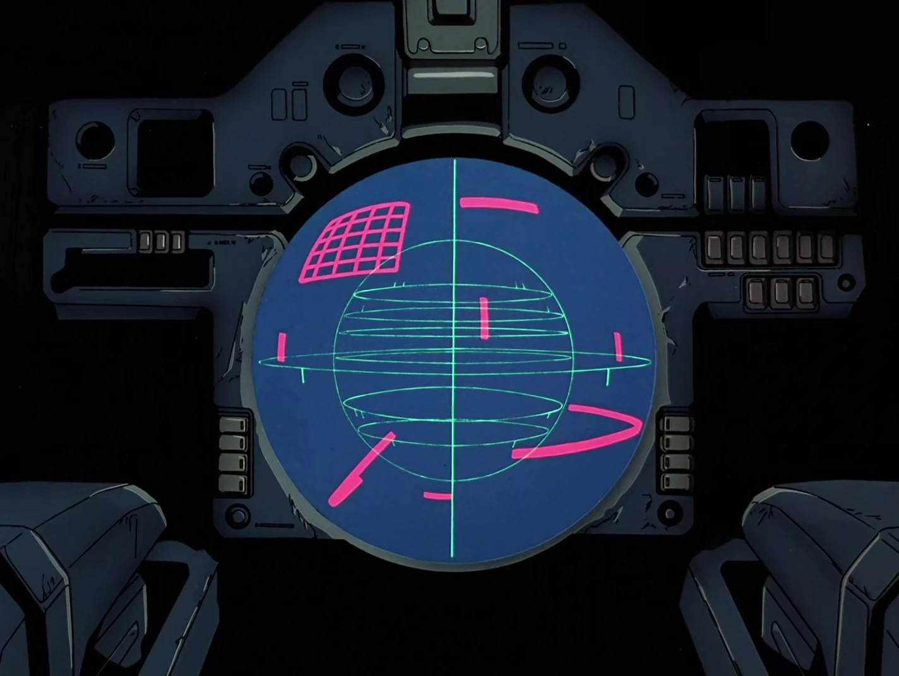

# Wing Gundam Agentic System (Zero System)



**Wing Gundam Agentic** is a highly advanced, theme-driven Agentic Operating System Monitor. Designed with the aesthetics of the *Zero System* from *Gundam Wing*, it serves as a powerful localized assistant for system security, network monitoring, and automated task management.

## 🚀 Core Features

### 🧠 Dual-Core Artificial Intelligence
*   **Hybrid Engine**: Switch seamlessly between **DeepSeek V3 (Cloud)** for maximum reasoning power and **Ollama (Local)** for privacy and offline capability.
*   **Per-Session Config**: Toggle providers instantly via the UI Configuration Modal.
*   **RAG Memory**: Integrated Retrieval-Augmented Generation (ChromaDB) allows the agent to remember past conversations, system logs, and context.

### 🛡️ Host & Network Management
*   **Live Host Tracking**: Maintain a database of network hosts (Servers, Workstations, IoT devices).
*   **Mass Scan (Ping-All)**: One-click network sweep to update the status (Online/Offline) of all known hosts with a strict 1-second timeout.
*   **Agentic Context**: The AI is aware of your network inventory and can answer questions like "Which servers are currently offline?".

### ⚡ Execution & Safety
*   **Command Execution**: Run shell commands directly from the chat interface (`bash`, `powershell`, etc.).
*   **Process Control**: Real-time feedback loops with an **Emergency Stop** button that instantly kills all child processes spawned by the agent.
*   **Approval Gate**: Toggle between **Auto-Pilot** (Agent runs commands immediately) and **Manual Mode** (User approves every action).

### 📅 Automated Scheduler
*   **Agentic Cron**: Schedule complex tasks (e.g., "Check disk space every morning and report if >90%").
*   **Self-Validation**: The agent validates your cron expressions and prompt instructions before saving tasks.
*   **Task Logging**: Detailed history of every executed task.

### 🔧 Issue Tracking
*   **System Lo**: Internal issue tracker where the agent can log problems it finds (or you report) until they are resolved.

## 🏗️ Architecture

### Backend (Python / FastAPI)
*   **Server**: FastAPI running on port `5501` (by default).
*   **Database**: SQLite (`wing_gundam.db`) managed via SQLAlchemy.
*   **Task Queue**: APScheduler for background cron jobs.
*   **Vector Store**: ChromaDB for RAG memory.
*   **Process Management**: uses `subprocess.Popen` with session management for robust process termination.

### Frontend (Next.js / TypeScript)
*   **Framework**: Next.js 14 (App Router) running on port `5500`.
*   **Styling**: TailwindCSS with custom "Scanline", "CRT", and "Glassmorphism" effects to match the Gundam aesthetics.
*   **Communication**: Real-time interaction with backend via REST API.

## 🛠️ Installation & Setup

### Prerequisites
*   **Python 3.10+**
*   **Node.js 18+**
*   **Ollama** (Optional, for local AI support)

### 1. Clone & Install
```bash
git clone https://github.com/JungAn2/WingGundamAgentic.git
cd WingGundamAgentic
```

### 2. Backend Setup
```bash
cd backend
python -m venv .venv
source .venv/bin/activate  # or .venv\Scripts\activate on Windows
pip install -r requirements.txt
cp .env.example .env
# Edit .env with your DEEPSEEK_API_KEY
```

### 3. Frontend Setup
```bash
cd frontend
npm install
```

## 🖥️ Usage

### Quick Start
We provide a unified start script for both Mac/Linux and Windows.

**Mac/Linux:**
```bash
./scripts/start.sh
```

**Windows:**
```powershell
./scripts/start_windows.ps1
```

Access the **Pilot Interface** at `http://localhost:5500`.

### Local LLM (Ollama) Setup
1. Install [Ollama](https://ollama.com/).
2. Pull a model (e.g., Mistral):
   ```bash
   ollama pull mistral
   ```
3. In the Web UI, click **CONFIG**, select **OLLAMA**, and type `mistral` as the model.

## 🔒 Security Note
This system provides **shell access** to the host machine. By default, it binds to `localhost`. If you need to access it remotely, use **SSH Local Forwarding**:
```bash
ssh -L 5500:localhost:5500 -L 5501:localhost:5501 user@remote-host
```
**DO NOT** expose this application directly to the public internet.

---
*Mission Accepted. Zero System Start.*